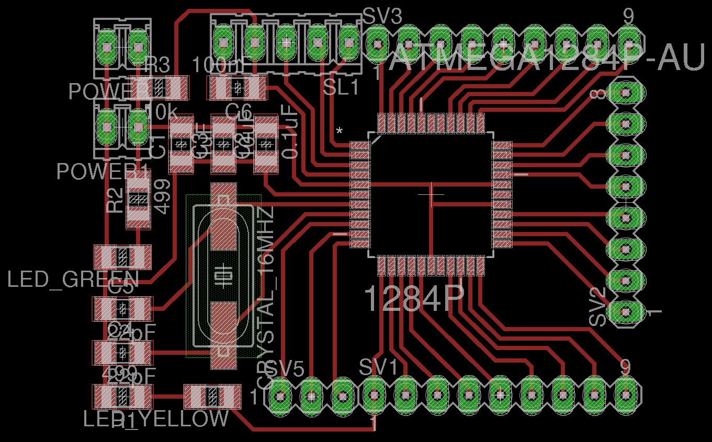

<h1 style="font-family: courier;" align="center"> satshakit 128</h1>

<i>An improved & fabbable Arduino IDE/libraries compatible board.</i>

  

What is satshakit?
--

satshakit is a **Arduino IDE  and libraries compatible**, fabbable and open source board, and also an improved version of [Fabkit](http://fabacademy.org/archives/2015/doc/projects/fabkit-0.4.html). 

satshakit boards
--

There are different kinds of **satshakit boards** depending on the **fabrication technique** you will use to make them, or on the **size** of the board. 

Here is a comparison table about different satshakit boards:

|name|mcu|pins|size(mm)|
| :---: | :---:|:---:|:---:|
|`satshakit laser`|ATmega328P|Arduino + ADC6/7|48 x 42|
|`satshakit cnc`|ATmega328P| Arduino + ADC6/7  |54 x 45|
|`satshakit multicore`|2 x ATmega328P| 2 x Arduino + ADC6/7|50 x 42|
|`satshakit micro`| ATmega328P|Arduino|40 x 24|
|`satshakit flight controller`| ATmega328P|MultiWii|48 x 48|
|`satshakit 128`| ATmega1284P|1284P|48 x 36|

Here you can find all of the satshakit boards: **[satshakit organization](https://github.com/satshakit)**.

satshakit 128
--

**satshakit 128** is microcontroller board designed around the **ATMega1284P** chip and it is suitable for complex scenarios in which is needed to have more flash and ram memory, but also the possibility to use 2 serial simultaneously.

In comparison with the other satshakits based on ATMega328P satshakit 128 has:

- **128k** flash memory instead of 32k
- **2 serials** instead of 1
- **16k of ram** instead of 2k
- **32 IO** pins instead of 23

Finally satshakit 128 is smaller than satshakit cnc and it costs **13 euro** each (much less for more).

Here you can have a look on **satshakit 128 board**:

**downloads (right click, download as)**

- [satshakit 128 svg](https://raw.githubusercontent.com/satshakit/satshakit-128/master/media/satshakit128.svg)
- [satshakit 128 internal png](https://raw.githubusercontent.com/satshakit/satshakit-128/master/media/satshakit128_internal.png)
- [satshakit 128 cut png](https://raw.githubusercontent.com/satshakit/satshakit-128/master/media/satshakit128_cut.png)
- [satshakit 128 schematic](https://raw.githubusercontent.com/satshakit/satshakit-128/master/eagle/satshakit128/satshakit128.sch)
- [satshakit 128 board](https://github.com/satshakit/satshakit-128/raw/master/eagle/satshakit128/satshakit128.brd)
- [satshakit 128 BOM Open Document](https://github.com/satshakit/satshakit-128/raw/master/docs/satshakit_128.ods)
- [satshakit 128 BOM Excel](https://github.com/satshakit/satshakit-128/raw/master/docs/satshakit_128.xlsx)

**media**

satshakit 128 uploading bootloader:

satshakit 128 uploading blink:

Getting Started
--
A satshakit board is **very similar to an Arduino board**, thus is possible to use the Arduino IDE and its libraries. When you finish solder satshakit 128, you have to program it. If you want to use satshakit as an Arduino, you first need to **upload Arduino bootloader**. This will also set the ATmega1284P fuses. Before doing any programming you need to **patch your arduino IDE** using a specific set of files that will add the satshakit 128 as an available board to use. 

To add the support for satshakit 128 you can use the **[Mighty 1284P](https://github.com/JChristensen/mighty-1284p/tree/v1.6.3)**, that is provided in this repo inside the **[mighty-1284p folder](https://github.com/satshakit/satshakit-128/tree/master/mighty-1284p)**. 

To do so follow these steps:

1. **download** satshakit 128 repository
2. close **Arduino IDE** before doing anything
3. copy the folder named **mighty-1284p** inside the **Arduino IDE hardware folder**, **arduino-1.6.x/hardware/** in Linux, **Documents/Arduino/hardware** in MacOS 
4. open again the Arduino IDE
5. select **avr-developers.com pinouts 16MHz using Optiboot** board

Now you can use an Arduino as ISP to burn the bootloader and any Arduino sketch you want. To upload a program you connect **Arduino to the satshakit 128** as follows:

Once everything is connected, follow these steps to upload Arduino bootloader:

1. open Arduino IDE 
2. select proper programmer Arduino as ISP
3. select **avr-developers.com pinouts 16MHz using Optiboot** board
4. click on tools->Burn Bootloader

After you burnt the bootloader you can also use an **FTDI usb cable** to program the satshakit 128. Here is the connection schema to program the satshakit 128 using an FTDI cable:

Remember that if you try to program the satshakit 128 using an Arduino, then you will also delete the bootloader, losing the capability to be programmed using the FTDI cable. To hae back this possibility burn again the bootloader.

Here is the Arduino pinout of the satshakit 128:

What's in the repo
--
- **[docs](https://github.com/satshakit/satshakit-128/tree/master/docs)**: BOM files for Farnell
- **[egle projects](https://github.com/satshakit/satshakit-128/tree/master/eagle/satshakit128)**: eagle projects of satshakit
- **[media](https://github.com/satshakit/satshakit-128/tree/master/media)**: svg of satshakits, connections schemas, images for cnc milling machine and fiber laser cutter, other images

Authors
--

- Daniele Ingrassia

Contact
--

- **ingrassiada@gmail.com**
- **[linkedin](http://it.linkedin.com/in/danieleingrassia)**

Thanks
--

[Fablab Kamp-Lintfort](http://fablab.hochschule-rhein-waal.de/index.php/de/) 
Hochschule Rhein-Waal 
Friedrich-Heinrich-Allee 25, 47475 Kamp-Lintfort, Germany 
fablab@hochschule-rhein-waal.de

[Mighty 1284P](https://github.com/JChristensen/mighty-1284p/tree/v1.6.3)

License
--
This work is licensed under the terms of Attribution-NonCommercial-ShareAlike 4.0 International ([CC BY-NC-SA 4.0](https://creativecommons.org/licenses/by-nc-sa/4.0/)).

Disclaimer  
--

This hardware/software is provided "as is", and you use the hardware/software at your own risk. Under no circumstances shall any author be liable for direct, indirect, special, incidental, or consequential damages resulting from the use, misuse, or inability to use this hardware/software, even if the authors have been advised of the possibility of such damages.

